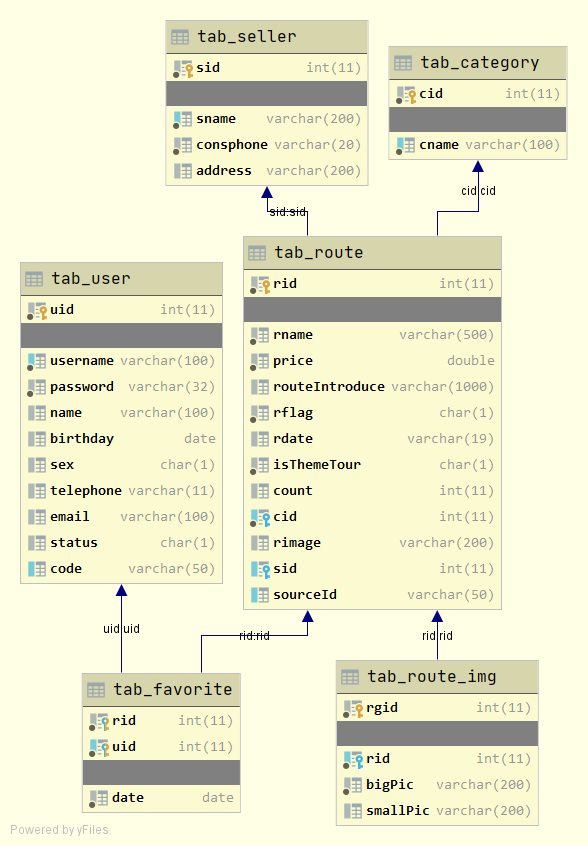
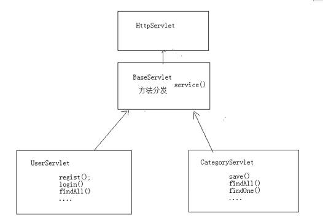

# JavaWeb-旅游网站项目

## 技术选型
- [x] Web层
  - [ ] Servlet：前端控制器
  - [ ] Html：视图
  - [ ] Filter：过滤器
  - [ ] BeanUtils：数据封装
  - [ ] Jackson：json序列化工具
- [x] Service层
  - [ ] Javamail：java发送邮件工具
  - [ ] Redis：nosql内存数据库
  - [ ] Jedis：java的redis客户端
- [x] Dao层
  - [ ] Mysql：数据库
  - [ ] Druid：数据库连接池
  - [ ] JdbcTemplate：jdbc的工具
  
  
## 数据库表结构

使用sql脚本完成数据库表的建立

+ tab_user：用户信息表
+ tab_category：分类条目表
+ tab_route：旅游线路表



## 主要实体类结构

|                            User类                            |                         ResultInfo类                         |                          Category类                          |                          PageBean类                          |                           Route类                            |                          RouteImg类                          |                           Seller类                           |      |
| :----------------------------------------------------------: | :----------------------------------------------------------: | :----------------------------------------------------------: | :----------------------------------------------------------: | :----------------------------------------------------------: | :----------------------------------------------------------: | :----------------------------------------------------------: | ---- |
| private int uid;//用户id<br/>    private String username;//用户名，账号<br/>    private String password;//密码<br/>    private String name;//真实姓名<br/>    private String birthday;//出生日期<br/>    private String sex;//男或女<br/>    private String telephone;//手机号<br/>    private String email;//邮箱<br/>    private String status;//激活状态，Y代表激活，N代表未激活<br/>    private String code;//激活码（要求唯一） | private boolean flag;//后端返回结果正常为true，发生异常返回false<br/>    private Object data;//后端返回结果数据对象<br/>    private String errorMsg;//发生异常的错误消息 | private int cid;//分类id<br /> private String cname;//分类名称 | private int totalCount; //总记录数<br /> private int totalPage;  //总页数 <br />private int currentPage;//当前页码<br /> private int pageSize;//每页显示的条数 <br />private List<T> list;//每页显示的数据集合 | private int rid;//线路id，必输<br /> private String rname;//线路名称，必输<br /> private double price;//价格，必输<br /> private String routeIntroduce;//线路介绍<br /> private String rflag;   //是否上架，必输，0代表没有上架，1代表是上架<br /> private String rdate;   //上架时间<br /> private String isThemeTour;//是否主题旅游，必输，0代表不是，1代表是<br /> private int count;//收藏数量<br /> private int cid;//所属分类，必输<br /> private String rimage;//缩略图<br /> private int sid;//所属商家<br /> private String sourceId;//抓取数据的来源id<br />  private Category category;//所属分类<br /> private Seller seller;//所属商家<br /> private List<RouteImg> routeImgList;//商品详情图片列表 | private int rgid;//商品图片<br />id private int rid;//旅游商品<br />id private String bigPic;//详情商品大图<br /> private String smallPic;//详情商品小图 | private int sid;//商家<br />id private String sname;//商家名称<br /> private String consphone;//商家电话<br /> private String address;//商家地址 |      |


## 用户模块

### 用户注册功能

|   架构   |                             前端                             |                          Servlet层                           |                          Service层                           |                            Dao层                             |
| :------: | :----------------------------------------------------------: | :----------------------------------------------------------: | :----------------------------------------------------------: | :----------------------------------------------------------: |
|   文件   |                        register.html                         |                      RegistUserServlet                       |                         UserService                          |                           UserDao                            |
| 功能说明 | 1. 使用js完成表单校验<br />2. 使用ajax提交表单数据到RegistUserServlet中进行注册<br />3. 根据ajax的相应数据data判断是否注册成功<br />4. 注册成功后，跳转到register_ok.html；否则显示注册失败的信息 | 1. 校验验证码，通过request获取前端的验证码check，与session中的CHECKCODE_SERVER进行比较，如果验证码不一样，直接返回错误信息，不必进行注册功能<br />获取前端表单的数据<br />2. 使用BeanUtils将数据封装为User对象<br />3. 调用service的功能函数完成注册<br />4. 根据service的返回值判断是否注册成功，并将提示信息存储到ResultInfo的对象info中，用于设置提示信息<br />5. 使用json将info对象序列化并发送给前端 | register()调用Dao层根据用户名查询用户<br />1. 查询存在，直接返回false说明用户名已经存在；<br />2.查询不存在，则调用Dao层保存该用户信息，说明注册成功 | 1. findByUsername()根据用户名查询是否存在该用户，返回查询结果user对象，如果不存在则为null<br />2. save()用于保存用户信息 |

+ 在register.html中编写js代码进行表单校验，在点击提交按钮或是某一输入框失去焦点时触发对应事件。
  1. `checkUsername()`校验用户名：单词字符，8-20位；
  2. `checkPassword()`校验密码：单词字符，8-20位；
  3. `checkEmail()`校验email：邮件格式；
  4. `checkName()校验`姓名：非空；
  5. `checkTelephone()`校验手机号：手机号格式；
  6. `checkBirthday()校验`出生日期：非空；
  7. `checkCheck()`校验验证码：非空

### 邮件激活功能

|   架构   |                             前端                             |                          Servlet层                           |                          Service层                           |                            Dao层                             |
| :------: | :----------------------------------------------------------: | :----------------------------------------------------------: | :----------------------------------------------------------: | :----------------------------------------------------------: |
|   文件   |      register_ok.html发送邮件给用户，邮件中附带激活链接      |                     ActivateUserServlet                      |                         UserService                          |                           UserDao                            |
| 功能说明 | 点击激活该用户，跳转到相关的ActivateUserServlet，并带有参数code，表示对应激活码（唯一标识） | 1. 获取激活码<br />2. 如果激活码不为空，使用service方法进行结果，根据返回值判断是否激活成功并显示相应的信息激活码查询对应的User对象 | activate()调用dao层进行对象的激活，首先根据激活码code查询是否存在该用户，若存在则更新该用户状态为激活，不存在则直接返回false | 1. findByCode()根据用户的激活码查询用户，返回查询结果user对象<br />2. updateStatus()更新用户状态status = 'Y'为激活 |

### 用户登录功能

|   架构   |                             前端                             |                          Servlet层                           |          Service层           |                        Dao层                        |
| :------: | :----------------------------------------------------------: | :----------------------------------------------------------: | :--------------------------: | :-------------------------------------------------: |
|   文件   |                          login.html                          |                         LoginServlet                         |         UserService          |                       UserDao                       |
| 功能说明 | 1. 设置登录按钮单击事件<br />2. 异步发送ajax请求，提交数据到LoginServlet，根据返回信息判断是否登录成功<br />3. 登录成功则跳转到index.html界面，否则显示错误提示 | 1. 获取用户信息，使用BeanUtils进行封装<br />2. 调用service中的方法查询user<br/>3. 根据查询返回的user对象，判断该用户是否存在以及是否激活，并保存对应的信息到info对象中<br />4. 如果用户存在且激活，则登录成功，需要**将该用户对象写入session中**<br />5. 使用json将info对象序列化并发送给前端 | login()调用dao层进行用户登录 | findByUsernameAndPassword()根据用户名和密码进行登录 |

### 显示用户登录状态和登出功能

|   架构   |                             前端                             |                          Servlet层                           |
| :------: | :----------------------------------------------------------: | :----------------------------------------------------------: |
|   文件   |                          head.html                           |              FindUserServlet<br />LogoutServlet              |
| 功能说明 | 1.在页面加载完成后，提交请求到FindUserServlet中获取当前登录的用户对象，并显示在页面上方<br />2.给登出按钮绑定单击事件，点击登出后，跳转到LogoutServlet执行登出操作 | 1.FindUserServlet接受前端的请求，在页面加载完成后，从当前session中获取存储的已登录的用户对象，并将该对象通过json写回到客户端浏览器中，前端界面通过ajax获取该用户名并显示<br />2.LogoutServlet销毁当前session并将页面跳转到login.html实现登出功能 |


## 优化Servlet :star::star::star:

在开发过程中，完成一个模块时，如用户模块，会产生多个Servlet（注册，登录，登出等），为了减少Servlet文件的数量，将多个Servlet中的功能全部抽象为对应的方法，集合到一个Servlet中。



如图所示：BaseServlet用于实现方法的分发，关于用户的操作，将方法全部写在UserServlet中。

### BaseServlet

重写HttpServlet中的service()方法，用于实现方法的分发。

1. 通过获取URI，如：`/project/user/login`；
2. 使用字符串方法获取URI中最后的方法名，如`login`；
3. 使用反射机制获取对应的方法，如：`UserServlet.login()`;
4. 使用`invoke()`执行方法。

```java
@Override
protected void service(HttpServletRequest req, HttpServletResponse resp) throws ServletException, IOException {
    //完成方法分发
    //1.获取请求路径
    String uri = req.getRequestURI();
    //2.获取方法名称
    String methodName = uri.substring(uri.lastIndexOf('/') + 1);
    //3.获取方法对象
    try {
        Method method = this.getClass().getMethod(methodName, HttpServletRequest.class, HttpServletResponse.class);
        //4.执行方法
        method.invoke(this, req, resp);
    } catch (NoSuchMethodException e) {
        e.printStackTrace();
    } catch (IllegalAccessException e) {
        e.printStackTrace();
    } catch (InvocationTargetException e) {
        e.printStackTrace();
    }
}
```

### UserServlet

1. 将之前实现各自功能的Servlet全部抽象成一个方法，如：`LoginServlet ->login()`，写入得到UserServlet中；
2. 需要将这些方法的修饰符从默认的`protected`修改为`public`。因为在BaseServlet中调用`getMethod()`执行对应方法，获取的是public方法，包括继承的方法，如果使用`getDeclaredMethods()`，可以取得所有自己声明的方法,包括 `public protected default private`。
3. 一些方法中多次定义使用的变量，如`UserService`，可以声明为UserServlet的成员变量。
4. UserServlet的请求路径修改为`/User/*`，代表User下的所有方法都会请求该Servlet，然后根据方法名，调用父类BaseServlet中的`service()`进行方法的分发执行。

```java
@WebServlet(urlPatterns = "/User/*")
public class UserServlet extends BaseServlet {
    private UserService userService = new UserServiceImpl();
    /**
     * 登录功能
     * @param request
     * @param response
     * @throws ServletException
     * @throws IOException
     */
    public void login(HttpServletRequest request, HttpServletResponse response) throws ServletException, IOException {
        Map<String, String[]> map = request.getParameterMap();
        User user = new User();
        try {
            BeanUtils.populate(user, map);
        } catch (IllegalAccessException e) {
            e.printStackTrace();
        } catch (InvocationTargetException e) {
            e.printStackTrace();
        }
        // UserService service = new UserServiceImpl();
        User u = userService.login(user);
        
        ResultInfo info = new ResultInfo();
        if (u == null) {
            info.setFlag(false);
            info.setErrorMsg("用户名或密码错误！");
        }
        if (u != null && !"Y".equals(u.getStatus())) {
            info.setFlag(false);
            info.setErrorMsg("您尚未激活，清先激活！");
        }
        if (u != null && "Y".equals(u.getStatus())) {
            request.getSession().setAttribute("user", u);
            info.setFlag(true);
        }
        ObjectMapper mapper = new ObjectMapper();
        response.setContentType("application/json; charset=UTF-8");
        mapper.writeValue(response.getOutputStream(), info);
    }
}
```

### 修改相关路径

最后还需要在请求Servlet的地方将原来的路径修改为新的路径，如：`/LoginServlet ->/User/login`。


## 分类显示模块

### 页面顶端分类栏显示

在页面加载完成时，顶端显示分类栏，包括：首页，门票，酒店，香港车票，出境游，国内游，港澳游，抱团定制，全球自由行，收藏排行榜。

|   架构   |                             前端                             |                          Servlet层                           |         Service层          |                     Dao层                     |
| :------: | :----------------------------------------------------------: | :----------------------------------------------------------: | :------------------------: | :-------------------------------------------: |
|   文件   |                         header.html                          |                       CategoryServlet                        |      CategoryService       |                  CategoryDao                  |
| 功能说明 | 在页面加载完成后，提交ajax请求，获取所有的分类，并显示在页面上方<br /> | findAll()调用service查询所有的分类条目，并将结果通过json写回客户端。 | findAll()调用dao层进行查询 | findAll()查询tab_category表中的所有数据并返回 |

#### :star: 优化

分析发现，分类的数据在每一次页面加载后都会重新请求数据库来加载，对数据库的压力比较大，而且分类的数据不会经常产生变化，所有可以使用**redis**来缓存这个数据。

**方法**：在service中查询时首先到redis中查询，如果查询结果为空，说明是第一次访问，将查询数据存入redis中；如果不为空，则表示不是第一次访问。最后返回查询结果集合即可。

修改`CategoryServiceImpl`中的findAll()方法：

```java
public List<Category> findAll() {
        //1.获取Jedis客户端
        Jedis jedis = JedisUtil.getJedis();
        //2.使用sortedset作为数据结构，key为category，0到-1表示所有
        Set<Tuple> redisCategories = jedis.zrangeWithScores("category", 0, -1);
        
        List<Category> categories = null;

        //3.判断redis缓存中的集合是否为空
        if (redisCategories == null || redisCategories.size() == 0) {
            //如果缓存中为空，从数据库中查询，并将结果写入缓存
            categories = categoryDao.findAll();
            for (int i = 0; i < categories.size(); i++) {
                jedis.zadd("category", categories.get(i).getCid(), categories.get(i).getCname());
            }
        } else {
            //4.如果不为空,将set的数据存入list
            categories = new ArrayList<Category>();
            for (Tuple tuple : redisCategories
            ) {
                Category category = new Category();
                category.setCname(tuple.getElement());
                category.setCid((int) tuple.getScore());
                categories.add(category);
            }
        }
        return categories;
}
```

### 分类内容的分页展示

点击不同的分类条目，进入具体类别的内容展示页面，进行分页显示。

#### 分类条目cid的传递

在查询分类对象category时，保存其中的cid属性值，用于传递给前端页面，使前端页面在点击相应分类条目时能够根据id进行跳转。

1. 在header.html页面中，对于每一个分类条目，传递cid的值

   ```js
   $.get("Category/findAll", {}, function (data) {
       var lis = '<li class="nav-active"><a href="index.html">首页</a></li>';
       for (var i = 0; i < data.length; i++) {
           var li = '<li><a href="route_list.html?cid= ' + data[i].cid + '">' + data[i].cname + '</a></li>';
           lis += li;
       }
       lis += '<li><a href="favoriterank.html">收藏排行榜</a></li>';
       $("#category").html(lis);
   });
   ```

2. 在route_list.html中获取点击的分类条目的cid的值，`location.search`方法会返回返回当前 URL 的查询部分，即问号 ? 之后的内容，在此处为`?cid=xx`

   ```js
   $(function () {
       var search = location.search;
       // 切割字符串，拿到第二个值
       var cid = search.split("=")[1];
   });
   ```

#### 分页展示功能

|   架构   |                             前端                             |                           服务器端                           |                          Service层                           |                            Dao层                             |
| :------: | :----------------------------------------------------------: | :----------------------------------------------------------: | :----------------------------------------------------------: | :----------------------------------------------------------: |
|   文件   |                       route_list.html                        |                         RouteServlet                         |                         RouteService                         |                           RouteDao                           |
| 功能说明 | 1. 客户端页面发送ajax请求用于请求Pagebean对象数据<br />2. 携带数据：currentPage当前页码，pageSize每页显示的条数，cid分页id | 1. 接受前端的参数，包括currentPage当前页码，pageSize每页显示的条数以及cid分页id；<br />2. 对于参数做合法性的验证和处理；<br />3. 调用service中的方法进行分页查询；<br />4. 查询结果为pageBean对象，将该对象通过json写回客户端。 | pageQuery()根据进行分页查询。<br />分别调用dao中的方法，查询总记录数以及当前页的数据集合，与其他数据一起封装到pageBean对象中并返回。 | findTotalCount查询总的记录数；<br />findByPage查询当前页的记录。 |


## 搜索功能

|   架构   |                             前端                             |                   服务器端                   |
| :------: | :----------------------------------------------------------: | :------------------------------------------: |
|   文件   |               route_list.html<br />header.html               | RouteServlet<br />RouteService<br />RouteDao |
| 功能说明 | 1. 在header.html中，给搜索按钮绑定单击事件，获取当前页面的cid以及搜索框的内容rname，拼接到跳转路径中<br />2. route_list.html中的分页显示代码中加入rname条件 | 对已有的查询相关方法进行重构，添加rname参数  |


## 商品详情页面

|   架构   |                             前端                             |                           服务器端                           |                          Service层                           |                  Dao层                   |
| :------: | :----------------------------------------------------------: | :----------------------------------------------------------: | :----------------------------------------------------------: | :--------------------------------------: |
|   文件   |            route_list.html<br />route_detail.html            |                         RouteServlet                         |                         RouteService                         | RouteDao<br />RouteImgDao<br />SellerDao |
| 功能说明 | 1. route_list.html中点击单个商品详情时执行跳转，跳转路径为：route_detail.html?rid=xxx<br />2. route_detail.html中当页面加载成功时发送ajax请求，根据rid查询对应的route对象 | findOne()方法：<br />1. 接受客户端的数据rid<br />2. 根据rid调用service查询对应的route对象<br />3. 将查询结果通过json写回客户端 | findOne()方法：<br />1. 根据rid调用RouteDao查询route对象<br />2. 根据rid调用RouteImgDao查询tab_route_img表，将结果集合写入到route对象中<br />3. 根据sid查询tab_seller查询卖家信息，将结果集合写入到route对象中 |   实现具体的查询方法去对应表中查询数据   |


